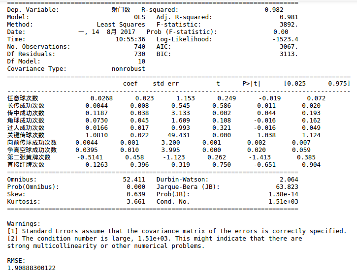
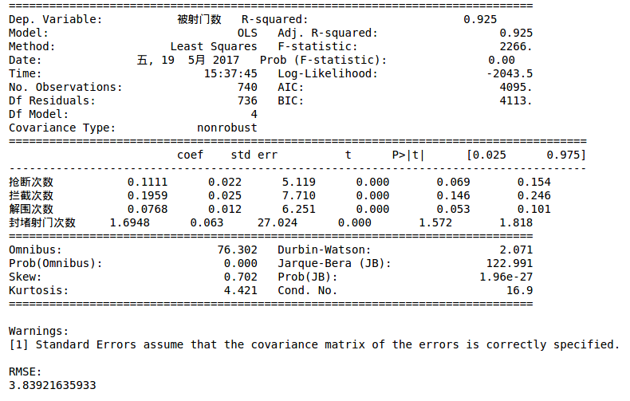

## 步骤1. 首先准备一个球队维度的数据集，有以下字段：

**进攻动作**
* 任意球次数 
* 长传成功次数 
* 传中成功次数 
* 角球成功次数 
* 过人成功次数 
* 关键传球次数 
* 向前传球成功次数 
* 争高空球成功次数 
* 第二张黄牌次数 
* 直接红牌次数

**防守动作**
* 抢断次数 
* 拦截次数 
* 解围次数 
* 封堵射门次数

**射门、被射门**
* 射门数
* 被射门数

**统计每个字段球队发生的总数，一场比赛有两行，第一行是主队的统计，第二行是客队的统计。射门数与被射门数两个队是相反的，主队射门数等于客队被射门数。以英超一个赛季为例，总共380场比赛，那么数据集有380x2=760行。**

---

## 步骤2. 这一步是回归分析。回归系数需要保存下来，后面用来计算球员的加权得分。

> 回归1: 射门数 ~ 任意球次数 + 长传成功次数 + 传中成功次数 + 角球成功次数 + 过人成功次数 + 关键传球次数 + 向前传球成功次数 + 争高空球成功次数 + 第二张黄牌次数 + 直接红牌次数

> 回归2: 被射门数 ~ 抢断次数 + 拦截次数 + 解围次数 + 封堵射门次数

**理解：这一步解出的回归系数取决于数据，因此英超两个赛季计算的回归系数不同，但同一赛季适用于每个球员，它是这个赛季的“平均”。回归系数beta的含义是在其他进攻动作不变的条件下，C罗每增加一个进攻动作（如任意球次数加1），皇马本场射门数增加beta个单位。**

---

## 步骤3. 接下来就是利用上述回归系数，计算每个球员应得分数。先准备一个数据集，统计球员在每一场比赛的技术统计，包含字段：

**进攻动作**
* 任意球次数 
* 长传成功次数 
* 传中成功次数 
* 角球成功次数 
* 过人成功次数 
* 关键传球次数 
* 向前传球成功次数 
* 争高空球成功次数 
* 第二张黄牌次数 
* 直接红牌次数

**防守动作**
* 抢断次数 
* 拦截次数 
* 解围次数 
* 封堵射门次数

**重要性指标**
* 本队本场射门效率（进球数/射门数）
* 本对本场获得积分
* 对手本场射门效率（进球数/射门数）
* 对手本场获得积分

**“重要性指标”是修正系数，本场比赛球员得分由以下公式计算。**
> R1 = (任意球次数 x beta1 + 长传成功次数 x beta2 + 传中成功次数 x beta3 + 角球成功次数 x beta4 + 过人成功次数 x beta5 + 关键传球次数 x beta6 + 向前传球成功次数 x beta7 + 争高空球成功次数 x beta8 + 第二张黄牌次数 x beta9 + 直接红牌次数 x beta10) x 本队本场射门效率（进球数/射门数） x 本对本场获得积分

> R2 = (抢断次数 x beta1 + 拦截次数 x beta2 + 解围次数 x beta3 + 封堵射门次数 x beta4） x 1/对手本场射门效率（进球数/射门数） x 1/对手本场获得积分

---

## 步骤4. 计算剩余几项指标，包括：
* R3=球员本赛季进球总数 x 1.05, 每个进球增加1.05分（可调整）
* R4=球员本赛季助攻总数 x 1.04, 每个助攻增加1.04分（可调整）
* R5=球队本场得到积分 x 球员本场出场时间/90
* R6=若本场零封对手（不失球），按位置增加分数{门将:0.51, 后卫:0.33, 中场:0.05, 前锋:0.03}，比如门将增加0.51分

---

## 步骤5. 
球员A的各项得分是他每场得分的累加，最后，球员A有6个维度得分R1~R6，加权平均比如：R = 0.2 x R1 + 0.4 x R2 + 0.1 x R3+ 0.05 x R4 + 0.1 x R5 + 0.15 x R6，每个球员（无论场上）位置用一个数字R表示得分。可以将所有（英超）球员的得分变换尺度到1~99分。

---

## 步骤6. 
未来：对其他数据源，只要有球员维度的赛后统计，这个方法仍然适用。回归的部分需要重新选择变量、参数可能不显著但是建议根据足球知识放进去有价值的变量，使球员的得分覆盖技战术动作更全面。
